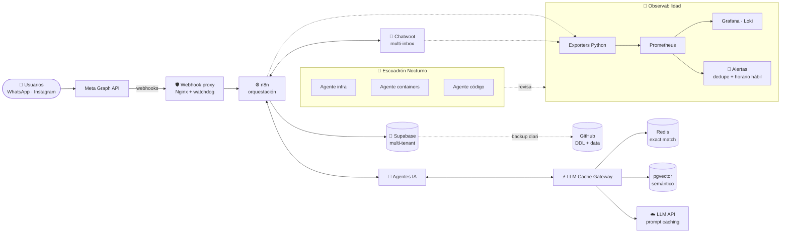
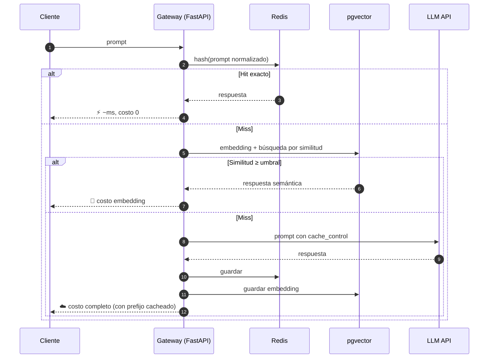
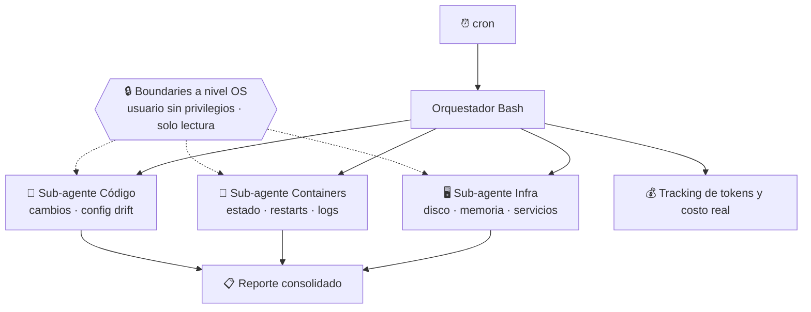

<div align="center">


📍 Salta, Argentina &nbsp;·&nbsp; 🕒 UTC-3 &nbsp;·&nbsp; 💼 Infrastructure Engineer · DevOps · AI Automation

[](https://www.linkedin.com/in/gaston010gv/)
[](https://github.com/gastongv)


</div>

---

> [!NOTE]
> **TL;DR** —  Opero un stack multi-tenant en producción (n8n, Chatwoot, WhatsApp Business API, Supabase, Redis, Docker) para clientes reales, lo monitoreo con Prometheus/Grafana, y le sumo **IA donde tiene sentido**: agentes conversacionales, caché semántico de LLMs, MCP servers y sub-agentes que revisan la infra mientras duermo.
>
> Abajo no hay una lista de tecnologías. Hay **cómo se armó cada cosa, qué se rompió y cómo lo resolví.** 👇

---

## 🗺️ El mapa: lo que opero todos los días



---

## 🤖 IA aplicada: qué hago, cómo y dónde NO la uso

La IA no es el producto, es una **capa más del stack** con los mismos requisitos que el resto: costos medibles, fallas controladas y credenciales seguras.

### Mi regla de diseño

```text
Capa 1 → Determinístico   (checks, reglas, SQL, regex)   → siempre corre, barato, auditable
Capa 2 → LLM              (clasificar, correlacionar, redactar) → opcional, cacheado, con límites
Capa 3 → Humano           (decisiones irreversibles)      → la IA propone, no ejecuta
```

### Dónde la aplico

| Caso de uso | Qué hace la IA | Cómo lo implemento | Qué la mantiene bajo control |
|---|---|---|---|
| 💬 **Agentes conversacionales** (WhatsApp / Instagram) | Atiende, califica y deriva consultas; se integra a un CRM | n8n + API oficial de WhatsApp Business + Chatwoot para handoff humano | Handoff a humano, contexto por tenant, prompts versionados |
| ⚡ **LLM Cache Gateway** | Evita pagar dos veces por la misma respuesta | Proxy FastAPI con 3 capas: Redis (exacta) → pgvector (semántica) → prompt caching nativo | Umbral de similitud, TTL por tipo de consulta, métricas de hit-rate |
| 🌙 **Monitoreo nocturno autónomo** | Revisa infra, containers y código; reporta hallazgos | Claude Code CLI con 3 sub-agentes especializados, disparado por cron | Límites de seguridad a nivel OS, solo lectura, tracking real de tokens y costo |
| 🧩 **MCP Servers** | Permite operar herramientas internas (tickets) en lenguaje natural | MCP server en Node.js sobre la API de Redmine | Scopes acotados, versiones pineadas del SDK |
| 🛡️ **Auditoría de infraestructura** | Correlaciona hallazgos y redacta el reporte | Motor determinístico + pipeline LangGraph opcional | El LLM nunca decide si algo *es* un hallazgo; solo lo explica |

### Lo que sé hacer con LLMs

<table>
<tr>
<td valign="top" width="50%">

**🏗️ Arquitectura**
- Tool use / function calling
- MCP servers (diseño, deploy, debugging)
- Agentes y sub-agentes con roles separados
- Orquestación con LangGraph y n8n
- RAG con pgvector

</td>
<td valign="top" width="50%">

**⚙️ Operación**
- Caching exacto, semántico y prompt caching
- Control de costos por token y por tenant
- Guardrails y límites de permisos a nivel OS
- Human-in-the-loop para acciones críticas
- Observabilidad de agentes (logs, costo, latencia)

</td>
</tr>
</table>

<details>
<summary><b>🔍 Ver cómo funciona el LLM Cache Gateway por dentro</b></summary>

<br/>



```python
async def resolve(prompt: str, tenant: str) -> Answer:
    key = cache_key(tenant, normalize(prompt))

    if hit := await redis.get(key):                      # Capa 1: exacta
        return Answer(hit, layer="exact")

    emb = await embed(prompt)
    if hit := await pgvector.nearest(tenant, emb, min_sim=THRESHOLD):  # Capa 2: semántica
        return Answer(hit.text, layer="semantic")

    text = await llm.complete(prompt, cache_system_prompt=True)       # Capa 3: prompt caching
    await asyncio.gather(
        redis.set(key, text, ex=ttl_for(prompt)),
        pgvector.upsert(tenant, emb, text),
    )
    return Answer(text, layer="llm")
```

</details>

---

## 🔥 Cómo se armó: historias de producción

Cada proyecto tiene un problema real detrás. Estos son los postmortems cortos.

<details>
<summary><b>📡 Meta empezó a rechazar webhooks… y el problema no era mi código</b></summary>

<br/>

| | |
|---|---|
| **Síntoma** | Webhooks de WhatsApp fallando de forma intermitente. El código y los certificados estaban bien. |
| **Causa raíz** | Rate-limiting de Meta aplicado **por ASN del proveedor de VPS**, no por IP ni por app. |
| **Fix** | Reverse proxy dedicado en otro proveedor, con Nginx configurado para **resolución DNS dinámica** (Nginx cachea el DNS del upstream al arrancar) + script watchdog en cron que verifica y levanta el servicio. |
| **Aprendizaje** | Cuando todo "está bien" y falla igual, bajá de capa: red, ASN, DNS. |

</details>

<details>
<summary><b>🚨 La plataforma de alertas me alertaba… de todo, todo el tiempo</b></summary>

<br/>

| | |
|---|---|
| **Síntoma** | Spam de alertas. Nadie las leía, que es lo mismo que no tener alertas. |
| **Causa raíz** | Reglas con `for: 0m`: cualquier pico de un scrape disparaba, se resolvía y volvía a disparar (flapping). |
| **Fix** | Ventanas `for:` razonables por severidad + workflow en n8n con **deduplicación por estado** y filtro de horario hábil para alertas no críticas. |
| **Aprendizaje** | Una alerta tiene que ser accionable. Si no, es ruido con formato. |

</details>

<details>
<summary><b>🧩 El MCP server dejó de funcionar sin que yo tocara nada</b></summary>

<br/>

| | |
|---|---|
| **Síntoma** | La integración de Redmine con Claude Desktop dejó de responder de un día para otro. |
| **Causa raíz** | Breaking change en una versión mayor del SDK de MCP, instalada automáticamente por no tener versión fijada. |
| **Fix** | Pinear la versión del SDK en la configuración del cliente y reparar el entorno Python (`uv`) corrupto. |
| **Aprendizaje** | En tooling de IA, que se mueve rápido, **pinear versiones no es opcional.** |

</details>

<details>
<summary><b>🌙 ¿Y si la infraestructura se auditara sola de noche?</b></summary>

<br/>



**La clave no fue el prompt, fue el sandbox:** cada sub-agente corre con un usuario del sistema sin privilegios y acceso de solo lectura. Aunque el modelo "quiera" hacer algo, el sistema operativo no lo deja.

</details>

<details>
<summary><b>💾 Backups de Supabase multi-tenant sin depender de nadie</b></summary>

<br/>

| | |
|---|---|
| **Problema** | Varios tenants en Supabase, sin un backup completo propio (esquema + datos) y versionado. |
| **Solución** | Función PL/pgSQL `export_full_backup()` que genera DDL + data, orquestada desde n8n, versionada en GitHub y con reporte automático por email. |
| **Resultado** | Cada backup es un commit: se puede ver qué cambió en el esquema entre dos días con un `git diff`. |

</details>

<details>
<summary><b>🔁 Migrar todo el stack sin que los clientes se enteren</b></summary>

<br/>

Migración de VPS legado a nueva infraestructura con Coolify + Nginx: TTL de DNS bajado días antes, servicios levantados en paralelo, sincronización de datos, validación de SSL y corte por DNS. **Sin downtime perceptible** para clientes en producción.

</details>

---

## 🚀 Proyectos

| | Proyecto | En una línea | Stack |
|---|---|---|---|
| 🔒 | **Plataforma de Monitoreo Multi-Cliente** | Dashboards aislados por cliente, alertas y panel admin | `Flask` `JWT+refresh` `TOTP 2FA` `RBAC` `Prometheus` `Grafana` `Loki` |
| 🌙 | **Escuadrón Nocturno** | Sub-agentes de IA que auditan la infra cada noche | `Claude Code` `Bash` `Cron` `OS sandboxing` |
| ⚡ | **LLM Cache Gateway** | 3 capas de caché para bajar costo y latencia de LLMs | `FastAPI` `Redis` `pgvector` |
| 🤖 | **Agentes IA para mensajería** | Agente + CRM + dashboard sobre WhatsApp / Instagram | `n8n` `WhatsApp Business API` `Chatwoot` |
| 🧩 | **Redmine MCP Server** | Operar tickets en lenguaje natural + recordatorios diarios | `Node.js` `MCP` `Ruby` |
| 📡 | **WhatsApp Webhook Proxy** | Esquivar rate-limiting por ASN | `Nginx` `Bash watchdog` |
| 💾 | **Backup Multi-Tenant** | DDL + data versionado en Git | `n8n` `PL/pgSQL` `GitHub` |
| 🛡️ | **Audit Analyzer Shell** `🚧 open source` | Auditoría one-shot por SSH con reportes asistidos por LLM | `Python` `LangGraph` `Textual` `PySide6` |

---

## 🛠️ Stack

<div align="center">


<br/><br/>


<br/>


</div>

<details>
<summary><b>🎓 Formación y background</b></summary>

<br/>

- 🎓 **Tecnicatura en Gestión de Infraestructura Cloud y DevOps** — UPATecO *(en curso)*
- 🎓 **Tecnicatura en Desarrollo de Software** — completa
- 🏢 **SAP Basis / Security** — roles y usuarios (PFCG, SU01), RFC (SM59), certificados (STRUST), SSO con SAML2 / Azure AD, migraciones ALE/IDoc, Fiori Launchpad

</details>

---

## 📊 Actividad

<div align="center">


</div>

---

<div align="center">

### 💬 ¿Hablamos?

Infraestructura que tiene que funcionar a las 3 AM, automatizaciones que ahorran horas reales o IA que tiene que rendir cuentas de lo que cuesta: **me interesa.**

[](https://www.linkedin.com/in/gaston010gv/)


</div>
