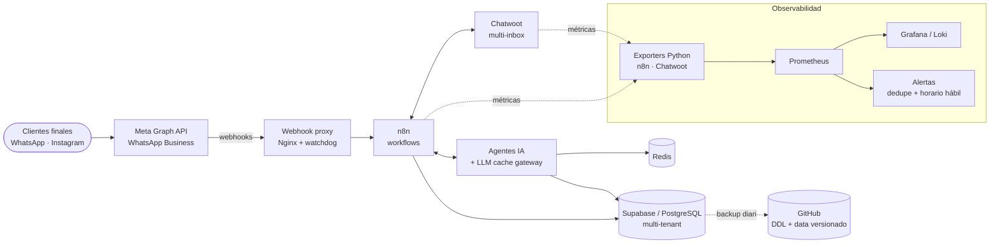

<div align="center">


**Infraestructura multi-tenant · Automatización end-to-end · Sistemas con LLMs en producción**

📍 Salta, Argentina &nbsp;·&nbsp; 🕒 UTC-3 &nbsp;·&nbsp; 🌐 Español / English (técnico)

[](https://www.linkedin.com/in/gaston010gv/)
[](https://github.com/gastongv)


</div>

---

## `$ whoami`

```yaml
name:      Gastón Villagra
role:      Infrastructure Engineer · DevOps · Automation Architect
location:  Salta, AR (remote-first)
focus:
  - Infraestructura multi-tenant en producción (Docker, Coolify, Nginx)
  - Observabilidad: Prometheus, Grafana, Loki + exporters propios
  - Automatización e integraciones: n8n, WhatsApp Business / Meta Graph API, Chatwoot
  - Sistemas con LLMs: caching semántico, agentes, MCP servers, LangGraph
principles:
  - "Si se hace dos veces a mano, se automatiza"
  - "Credenciales fuera del código, siempre (JWT, secrets, least privilege)"
  - "Sin métricas no hay producción, hay esperanza"
education:
  - Tecnicatura en Gestión de Infraestructura Cloud y DevOps — UPATecO (en curso)
  - Tecnicatura en Desarrollo de Software — completa
background: SAP Basis / Security (PFCG, SU01, SM59, STRUST, SAML2/SSO, ALE/IDoc)
```

---

## 🔭 En qué estoy ahora

- 🛡️ **Audit Analyzer Shell** — herramienta open source de auditoría de infraestructura *one-shot* vía SSH (sin agente en el host). Motor determinístico de checks + pipeline **LangGraph** opcional para correlación y reportes. CLI → TUI (Textual) → GUI (PySide6). Desarrollo guiado por specs (SDD). `🚧 en desarrollo`
- 🤖 **Agentes de IA para WhatsApp e Instagram** — agente conversacional + CRM + dashboard sobre la API oficial de WhatsApp Business.
- 🎯 Profundizando en **arquitecturas LLM de producción**: caching multi-capa, evaluación, costos y observabilidad de agentes.

---

## 🛠️ Stack

<div align="center">

**Infra & DevOps**


**Backend & Datos**


**Automatización & Mensajería**


**AI / LLM**


**Observabilidad**


</div>

---

## 🧭 Cómo se ve lo que opero



---

## 🚀 Proyectos destacados

| Proyecto | Qué resuelve | Stack |
|---|---|---|
| 🔒 **Plataforma de Monitoreo Multi-Cliente** | Observabilidad por cliente con dashboards aislados, alertas por email y panel admin. | `Flask` `JWT + refresh` `TOTP 2FA` `RBAC 3 roles` `Prometheus` `Grafana` `Loki` |
| 🌙 **Escuadrón Nocturno de Monitoreo** | Revisión autónoma nocturna de infra con sub-agentes especializados (infra / containers / código) y límites de seguridad a nivel OS. | `Claude Code CLI` `Bash` `Cron` `cost tracking real` |
| ⚡ **LLM Cache Gateway** | Reduce costo y latencia de LLMs con 3 capas de caché: exacta, semántica y prompt caching nativo. | `FastAPI` `Redis` `pgvector` `Prompt caching` |
| 🧩 **Redmine MCP Server** | Expone Redmine como herramientas MCP para operar tickets desde Claude + recordatorios diarios automáticos. | `Node.js` `MCP` `Ruby rake task` `Cron` |
| 📡 **WhatsApp Webhook Proxy** | Reverse proxy dedicado para evitar rate-limiting de Meta por ASN del proveedor, con resolución DNS dinámica y watchdog. | `Nginx` `DigitalOcean` `Bash watchdog` |
| 💾 **Backup Multi-Tenant (Supabase)** | Respaldo full DDL + data versionado en GitHub, con reporte automático por email. | `n8n` `PL/pgSQL` `GitHub` |
| 🔁 **Migración Zero-Downtime** | Migración completa de stack de VPS legado a nueva infraestructura sin downtime perceptible. | `Docker` `Coolify` `Nginx` `DNS/SSL` |
| 🛡️ **Audit Analyzer Shell** `🚧` | Auditoría de seguridad/infra one-shot por SSH con reportes asistidos por LLM. Open source. | `Python` `LangGraph` `Textual` `PySide6` |

---

## 📊 GitHub

<div align="center">


</div>

---

<div align="center">

```bash
$ echo "Automatización, alta disponibilidad y seguridad — sin atajos manuales."
```

<sub>Última actualización: septiembre 2026</sub>

</div>
